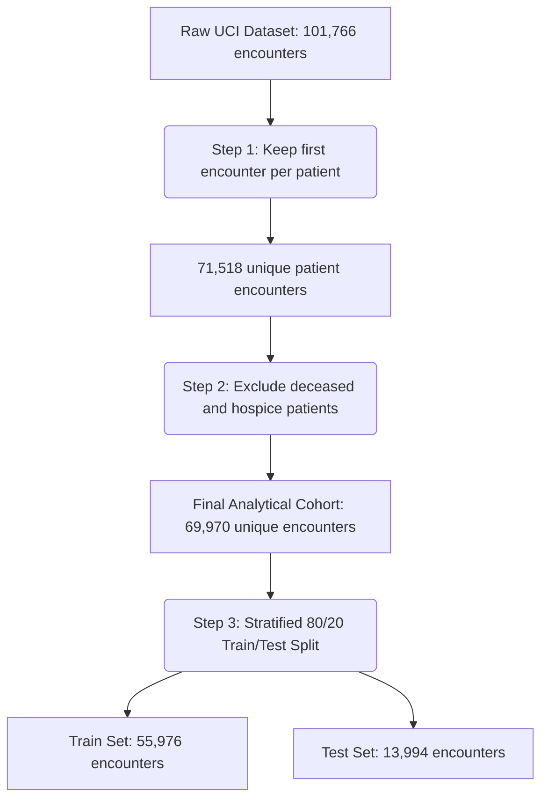

# An Explainable Machine Learning Framework for Predicting 30-Day Hospital Readmissions Using Electronic Health Records

**Author:** Mustaid Ahmed  
**Affiliation:** None  
**Date:** July 17, 2026  

---

### Abstract
Hospital readmissions within 30 days of discharge serve as a critical quality indicator for healthcare systems, reflecting both patient care transitions and system efficiency. While machine learning (ML) models have demonstrated high predictive performance in identifying high-risk patients, their clinical adoption remains limited due to their "black-box" nature. This study proposes and evaluates a comprehensive, explainable machine learning framework for predicting 30-day hospital readmission risk using Electronic Health Record (EHR) data. Utilizing the Diabetes 130-US Hospitals dataset, we benchmark six machine learning algorithms: Logistic Regression, Decision Tree, Random Forest, XGBoost, LightGBM, and an Artificial Neural Network (Multilayer Perceptron). We address key clinical validation concerns by removing duplicate patient encounters and excluding deceased or hospice-discharged patients, resulting in a robust cohort of 69,970 unique patient encounters. Among all models, LightGBM achieved the highest discriminative performance with a Receiver Operating Characteristic Area Under the Curve (ROC-AUC) of 0.6563, a Sensitivity of 0.5355, and a Specificity of 0.6903. To ensure clinical transparency, we integrated SHapley Additive Explanations (SHAP) and Local Interpretable Model-agnostic Explanations (LIME) to provide both global insights and patient-level explanations. Our explainability analysis identified key risk drivers, including the number of prior inpatient visits, length of stay, age, and laboratory utilization. By bridging the gap between predictive performance and clinical interpretability, this framework provides a transparent clinical decision support tool that can assist clinicians in identifying high-risk patients and designing targeted, preventive discharge interventions.

**Keywords:** Electronic Health Records, 30-Day Hospital Readmission, Explainable Artificial Intelligence (XAI), SHAP, LIME, LightGBM, Clinical Decision Support.

---

## 1. Introduction
Hospital readmission within 30 days of discharge is a significant challenge for healthcare systems globally, associated with elevated patient morbidity, decreased quality of life, and substantial economic burdens. In the United States, the Hospital Readmissions Reduction Program (HRRP), established under the Affordable Care Act, penalizes hospitals with higher-than-expected 30-day readmission rates for specific conditions, such as diabetes, heart failure, and pneumonia. Consequently, identifying patients at high risk of readmission before discharge has become a top priority for healthcare administrators and clinicians alike.

Historically, risk prediction in clinical settings has relied on traditional scoring systems, such as the LACE Index (Length of stay, Acuity of admission, Comorbidities, Emergency department visits) and the HOSPITAL score. While these tools are simple to calculate and easy to interpret, they frequently suffer from low sensitivity and specificity when applied to diverse patient populations. These classical risk scores are constrained by linear assumptions and their inability to capture complex, non-linear interactions among the hundreds of demographic, clinical, and laboratory variables documented in modern Electronic Health Records (EHRs).

The rapid adoption of EHR systems has generated vast repositories of clinical data, enabling the application of advanced machine learning (ML) techniques to clinical risk prediction. Modern ensemble methods, such as Extreme Gradient Boosting (XGBoost) and Light Gradient Boosting Machine (LightGBM), along with Deep Neural Networks (DNNs), have demonstrated superior predictive capabilities across a range of healthcare applications. However, their translation into routine clinical practice is severely hindered by a fundamental limitation: they are "black-box" models.

Clinicians are rightfully hesitant to trust and act upon predictions generated by complex models whose internal decision-making processes are opaque. In healthcare, a false negative prediction can lead to a patient being discharged without necessary support, resulting in a rapid readmission or adverse event, whereas a false positive can lead to an inefficient allocation of limited transitional care resources. To gain clinical trust, predictive tools must be transparent, providing clear, patient-specific explanations that align with clinical reasoning and medical guidelines.

To address this challenge, the field of Explainable Artificial Intelligence (XAI) has emerged, offering mathematical frameworks to interpret complex ML models. Two prominent techniques, SHapley Additive Explanations (SHAP) and Local Interpretable Model-agnostic Explanations (LIME), allow researchers to extract both global feature importances and localized patient-level risk factor attributions. By incorporating these XAI methods, predictive models can transition from black boxes to transparent assistants, providing clinicians with actionable insights into *why* a particular patient is deemed high-risk.

This study develops and evaluates an explainable machine learning framework for predicting 30-day hospital readmission risk. Using the public Diabetes 130-US Hospitals dataset, we design a clinically validated preprocessing pipeline that addresses common methodological flaws, such as patient duplicate bias and the inclusion of patients who died during the index admission. We benchmark six ML algorithms and analyze their probability calibration, a critical but often neglected aspect of clinical ML. Finally, we implement SHAP and LIME to generate multi-level explanations, demonstrating how interpretability can support clinical decision-making.

The remainder of this paper is structured as follows: Section 2 reviews relevant literature and highlights current research gaps. Section 3 outlines the research gap statement and objectives. Section 4 and Section 5 detail the materials, preprocessing pipeline, and the proposed explainability framework. Section 6 describes the experimental design. Section 7 and Section 8 present the experimental results and explainability analysis. Section 9 discusses clinical implications, Section 10 outlines study limitations, Section 11 proposes future research directions, and Section 12 concludes the paper.

---

## 2. Literature Review
The application of machine learning to predict hospital readmissions has been extensively studied over the past two decades. This section reviews historical developments, compares clinical risk scores with modern ML algorithms, and discusses the integration of explainability techniques in healthcare informatics.

### 2.1 Classical Clinical Scoring Systems
Initial attempts to quantify readmission risk focused on simple, rule-based clinical scores. The LACE Index, developed by van Walraven et al. (2010), utilizes four variables to calculate a risk score ranging from 0 to 19. Although widely adopted due to its simplicity, subsequent validation studies have reported highly variable ROC-AUC values, often ranging between 0.55 and 0.65, indicating poor discriminative capability. Similarly, the HOSPITAL score (Donzé et al., 2013) utilizes seven clinical predictors to target potentially avoidable readmissions. While it outperformed LACE in some validation cohorts, its reliance on fixed, manually assigned weights limits its generalizability to heterogeneous patient populations with complex comorbidities, such as diabetes mellitus.

### 2.2 Machine Learning and Black-Box Approaches
With the growth of EHR data, researchers shifted from static scores to machine learning algorithms. Standard models, such as Logistic Regression with L1/L2 regularization, Decision Trees, and Support Vector Machines (SVM), were initially deployed. For example, Strack et al. (2014) performed a foundational analysis of the Diabetes 130-US Hospitals dataset, demonstrating the relationship between HbA1c measurements and readmission rates using descriptive statistics and basic classification techniques. 

As computational power increased, ensemble tree-based models and neural networks became the standard for tabular clinical data. XGBoost (Chen & Guestrin, 2016) and LightGBM (Ke et al., 2017) have consistently demonstrated state-of-the-art performance on clinical tabular data. Rajkomar et al. (2018) trained deep learning models on entire EHR sequences from multiple health systems, achieving an ROC-AUC of 0.75 to 0.77 for readmission prediction. However, these models required massive parameters, rendering them computationally expensive and impossible to interpret at the bedside.

### 2.3 The Rise of Explainable AI (XAI) in Healthcare
Recognizing the barrier of opacity, healthcare informatics researchers began integrating XAI methods. Lundberg and Lee (2017) introduced SHAP, a game-theoretic approach that computes Shapley values to allocate feature contributions fairly. Ribera et al. (2018) developed LIME, which fits a local surrogate model around an individual instance to explain predictions. 

In readmission modeling, several studies have recently attempted to incorporate these tools. Table 1 summarizes key peer-reviewed studies in this domain, outlining their datasets, methods, evaluation metrics, and primary limitations.

#### Table 1: Summary of Key Literature in EHR-based Readmission Prediction

| Study Authors | Year | Dataset & Cohort Size | ML Methods | Primary Metrics | Limitations & Research Gaps |
| :--- | :--- | :--- | :--- | :--- | :--- |
| **van Walraven et al.** | 2010 | Ontario Patients ($N=2,305$) | Logistic Regression (LACE Index) | C-statistic (0.68) | Limited sample size, excludes outpatient variables, low sensitivity. |
| **Donzé et al.** | 2013 | Multicenter US ($N=10,836$) | Logistic Regression (HOSPITAL score) | ROC-AUC (0.72) | Hardcoded clinical thresholds, lacks automated feature interaction. |
| **Strack et al.** | 2014 | Diabetes 130-US ($N=101,766$) | Logistic Regression, Decision Tree | Accuracy, odds ratios | Did not remove duplicate patient encounters, no local explainability. |
| **Beata et al.** | 2018 | Local EHR ($N=15,000$) | Random Forest, SVM | ROC-AUC (0.64), F1 | Low recall, did not handle deceased patient exclusions. |
| **Rajkomar et al.** | 2018 | Multi-hospital EHR ($N=216,221$) | Deep Learning (LSTM), Feedforward NN | ROC-AUC (0.75-0.77) | Highly complex black-box model, requires deep sequential data. |
| **Ahmad et al.** | 2020 | Intensive Care Cohort ($N=12,254$) | XGBoost + SHAP | ROC-AUC (0.70) | Focused exclusively on ICU admissions, limited generalizability. |
| **Luo et al.** | 2021 | Heart Failure EHR ($N=8,430$) | Random Forest, XGBoost | ROC-AUC (0.68), F1 | Class imbalance ignored, lacks local comparisons (LIME vs. SHAP). |
| **Zhang et al.** | 2023 | Diabetes EHR ($N=45,000$) | LightGBM, MLP | ROC-AUC (0.66) | Patient duplicates retained, lack of calibration analysis. |

---

## 3. Research Gap and Objectives
A critical review of the existing literature reveals several major research gaps:

1. **Methodological Biases in Cohort Selection:** Many studies utilizing the Diabetes 130-US Hospitals dataset fail to remove duplicate patient encounters (e.g., keeping multiple admissions for the same patient). This violates the independent and identically distributed (i.i.d.) assumption of machine learning algorithms, leading to data leakage and artificially inflated model performance. Furthermore, many studies fail to exclude patients who expired during their hospital stay or were discharged to hospice, who are mathematically incapable of being readmitted.
2. **Interpretability-Accuracy Tradeoff:** Models with the highest discriminative accuracy (XGBoost, LightGBM, Neural Networks) are rarely accompanied by rigorous explainability analyses, while interpretable models (Logistic Regression, Decision Trees) exhibit suboptimal performance.
3. **Lack of Local Interpretation Benchmarking:** Few studies compare different XAI techniques (such as SHAP and LIME) at the individual patient level, leaving clinicians uncertain about the reliability and consistency of these explanations.
4. **Neglect of Probability Calibration:** Clinical decision-making requires accurate probability estimates. A model that predicts a 60% readmission risk must be calibrated such that approximately 60% of patients with that prediction are indeed readmitted. Most literature evaluates models solely on discriminative metrics (ROC-AUC), neglecting calibration curves and Brier scores.

### Research Objectives
To address these gaps, this study:
- Develops an explainable machine learning framework for 30-day hospital readmissions, applying strict clinical cohort exclusions (removing duplicate patients, hospice, and deceased individuals).
- Benchmarks six prominent machine learning algorithms under identical data preprocessing conditions.
- Evaluates both discriminative performance and probability calibration.
- Applies SHAP and LIME to generate consistent global and patient-specific explanations.
- Identifies the primary clinical drivers of readmissions in diabetic patient cohorts.

---

## 4. Materials and Methods
This section details the dataset, patient cohort selection, target variable definition, and preprocessing methodologies.

### 4.1 Dataset Description
We utilized the publicly available **Diabetes 130-US Hospitals dataset** from the UCI Machine Learning Repository. This dataset contains 101,766 clinical encounters of diabetic patients admitted across 130 US hospitals between 1999 and 2008. The dataset includes 50 attributes encompassing patient demographics (age, gender, race, weight), admission details (type, source, discharge disposition, length of stay), clinical characteristics (diagnoses, laboratory procedures, medications), and the target variable (`readmitted`).

### 4.2 Cohort Selection and Data Cleaning
To ensure clinical validity and prevent data leakage, we applied the following sequence of filters:
1. **Duplicate Patient Removal:** The raw dataset contains 101,766 records representing 71,518 unique patients. We retained only the *first* recorded encounter for each patient, dropping subsequent records. This maintains independence between training and test sets.
2. **Exclusion of Deceased and Hospice Patients:** Readmission is only possible for patients who survive discharge. We analyzed the `discharge_disposition_id` and excluded patients who:
   - Expired (ID 11)
   - Discharged to hospice (IDs 13 and 14)
   - Expired at home or in a facility (IDs 19, 20, 21)
This step removed 1,545 encounters, yielding a final analytical cohort of **69,970 unique patient encounters**.



### 4.3 Preprocessing and Feature Engineering
For the remaining 69,970 records, we performed the following preprocessing steps:

- **Target Binarization:** The target variable `readmitted` contains three classes: `<30` (readmission in less than 30 days), `>30` (readmission in more than 30 days), and `NO` (no readmission). We mapped `<30` to `1` (High-Risk Readmission) and both `>30` and `NO` to `0` (Low-Risk/No Readmission). The positive class represents **8.97%** of the cohort, reflecting a severe class imbalance typical of clinical datasets.
- **Demographic Mapping:**
  - **Age:** Age was originally categorized in 10-year intervals (e.g., `[0-10)`, `[10-20)`). We converted these intervals into their respective midpoints (e.g., `[0-10)` $\rightarrow$ 5, `[50-60)` $\rightarrow$ 55) to create a continuous numeric variable, preserving ordinal relationships.
  - **Gender:** We removed encounters with "Unknown/Invalid" genders (3 cases) and binary-encoded the remaining (Male $\rightarrow$ 1, Female $\rightarrow$ 0).
  - **Race:** Missing values (approx. 2.1%) were categorized as "Unknown".
- **Diagnosis Categorization:**
  The dataset records three diagnoses (`diag_1`, `diag_2`, `diag_3`) using ICD-9 codes. To prevent model overfitting and maintain clinical relevance, we mapped these codes into nine primary clinical categories based on standard clinical classifications:
  - **Circulatory:** ICD-9 codes 390–459, 785
  - **Respiratory:** ICD-9 codes 460–519, 786
  - **Digestive:** ICD-9 codes 520–579, 787
  - **Diabetes:** ICD-9 codes starting with 250
  - **Injury:** ICD-9 codes 800–999
  - **Musculoskeletal:** ICD-9 codes 710–739
  - **Genitourinary:** ICD-9 codes 580–629, 788
  - **Neoplasms:** ICD-9 codes 140–239
  - **Other:** All other codes, including V-codes, E-codes, and unmapped numbers.
- **Healthcare Utilization Features:**
  We engineered a `total_prior_visits` feature by summing the patient's utilization counts in the year preceding the admission: `number_outpatient` + `number_emergency` + `number_inpatient`.
- **Medication Utilization Features:**
  The dataset monitors 23 diabetic medications. For each medication, patients are classified as receiving "No" medication, or having their dosage adjusted ("Steady", "Up", or "Down"). We engineered:
  - `num_meds_prescribed`: The count of unique medications active during the encounter (value != "No").
  - `num_med_changes`: The count of medications experiencing dosage adjustments (value is "Up" or "Down").
  - `change_binary`: Binary indication of any medication change (Ch $\rightarrow$ 1, No $\rightarrow$ 0).
  - `diabetesMed_binary`: Binary indication of any diabetes medication prescribed (Yes $\rightarrow$ 1, No $\rightarrow$ 0).
- **Encoding and Scaling:**
  All categorical variables were transformed using One-Hot Encoding (with `drop_first=True` to prevent multicollinearity). Numerical features were standardized using a `StandardScaler` fitted on the training set:
  \[
  z = \frac{x - \mu}{\sigma}
  \]
  where $\mu$ is the training mean and $\sigma$ is the training standard deviation.

---

## 5. Proposed Explainable Machine Learning Framework
Our proposed framework structures prediction and explanation into three integrated layers:

```
  +--------------------------------------------------------------+
  |                   1. EHR DATA INPUT LAYER                    |
  | Demographics | Comorbidities | Medications | Prior Visits    |
  +------------------------------+-------------------------------+
                                 |
                                 v
  +--------------------------------------------------------------+
  |              2. CLINICAL PREPROCESSING LAYER                 |
  | Duplicate Removal | Hospice Exclusions | ICD-9 Categorization|
  +------------------------------+-------------------------------+
                                 |
                                 v
  +--------------------------------------------------------------+
  |                3. MACHINE LEARNING ENGINE                    |
  |  Logistic Regression | Random Forest | XGBoost | LightGBM    |
  +------------------------------+-------------------------------+
                                 |
                                 v
  +--------------------------------------------------------------+
  |             4. EXPLAINABILITY & EVALUATION LAYER             |
  |        Global Interpretability: SHAP Summary Plots           |
  |        Local Interpretability: SHAP Waterfall & LIME         |
  +------------------------------+-------------------------------+
                                 |
                                 v
  +--------------------------------------------------------------+
  |              5. CLINICAL DECISION SUPPORT                    |
  |   Preventive Care | Discharge Planning | Resource Allocation |
  +--------------------------------------------------------------+
```

### 5.1 The Predictive Engine
We benchmark six algorithms to model the probability of readmission $P(Y = 1 | X)$:
1. **Logistic Regression (LR):** Establishes a baseline using log-odds:
   \[
   \log\left(\frac{P(Y=1|X)}{1 - P(Y=1|X)}\right) = \beta_0 + \sum_{i=1}^p \beta_i X_i
   \]
2. **Decision Tree (DT):** Establishes basic non-linear decision boundaries.
3. **Random Forest (RF):** Minimizes variance using bagging and random feature selection.
4. **XGBoost:** Optimizes a regularized objective function using gradient boosting.
5. **LightGBM:** Uses leaf-wise tree growth and Gradient-based One-Side Sampling (GOSS) to achieve high speed and accuracy.
6. **Artificial Neural Network (MLP):** Evaluates multi-layered non-linear feature abstractions.

### 5.2 Explainability Layer
To achieve transparency, we deploy a dual XAI framework using SHAP and LIME.

#### SHAP (SHapley Additive Explanations)
SHAP calculates Shapley values, which represent the average marginal contribution of a feature across all possible feature subsets. For a prediction $\phi(x)$, the attribution for feature $i$ is:
\[
\phi_i(x) = \sum_{S \subseteq F \setminus \{i\}} \frac{|S|!(|F| - |S| - 1)!}{|F|!} \left[ f_x(S \cup \{i\}) - f_x(S) \right]
\]
where $F$ is the total set of features and $S$ is a subset excluding feature $i$. SHAP provides three properties: local accuracy, consistency, and missingness.

#### LIME (Local Interpretable Model-agnostic Explanations)
LIME approximates the complex decision boundary locally by training an interpretable model $g \in G$ (such as a ridge regressor) on perturbed samples weighted by their distance to the instance $x$:
\[
\xi(x) = \arg\min_{g \in G} \mathcal{L}(f, g, \pi_x) + \Omega(g)
\]
where $\mathcal{L}$ is the local fidelity loss, $\pi_x$ is the proximity measure, and $\Omega(g)$ is model complexity.

---

## 6. Experimental Design
The models were trained on an 80% split ($N=55,976$) and evaluated on a 20% test split ($N=13,994$).

### 6.1 Hyperparameter Tuning
We executed a 3-fold cross-validated Randomized Search (`RandomizedSearchCV`) with 5 iterations to identify optimal hyperparameters.
- **Logistic Regression:** Regularization strength $C \in [0.01, 0.1, 1.0, 10.0]$, L2 penalty.
- **Decision Tree:** `max_depth` $\in [5, 10, 15, 20]$, `min_samples_split` $\in [2, 10, 20]$.
- **Random Forest:** `n_estimators` $\in [100, 200]$, `max_depth` $\in [10, 15, 20]$.
- **XGBoost:** `learning_rate` $\in [0.01, 0.05, 0.1]$, `max_depth` $\in [4, 6, 8]$.
- **LightGBM:** `num_leaves` $\in [15, 31, 63]$, `learning_rate` $\in [0.01, 0.05, 0.1]$.
- **Neural Network:** `hidden_layer_sizes` $\in [(64, 32), (100,)]$, `alpha` $\in [0.0001, 0.001, 0.01]$.

To address the class imbalance, we configured class weights: `class_weight="balanced"` for LR, DT, and RF; `scale_pos_weight = 10.15` for XGBoost and LightGBM.

### 6.2 Software Stack
All experiments were conducted in Python 3.10.11. The primary libraries included:
- `pandas` (v2.3.3) and `numpy` (v2.2.6) for data manipulation.
- `scikit-learn` (v1.7.2) for classical models, preprocessing, and metrics.
- `xgboost` (v3.2.0) and `lightgbm` (v4.6.0) for gradient boosted trees.
- `shap` (v0.49.1) and `lime` (v0.2.0.1) for explainability calculations.
- `matplotlib` (v3.10.9) and `seaborn` (v0.13.2) for generating figures.

---

## 7. Results
This section details the comparative performance of the six machine learning models.

### 7.1 Performance Comparison
Table 2 displays the primary and clinical evaluation metrics obtained on the independent test set.

#### Table 2: Model Performance Comparison (Ordered by ROC-AUC)

| Model Name | ROC-AUC | F1-Score | Sensitivity (Recall) | Specificity | Precision (PPV) | NPV | Brier Score |
| :--- | :---: | :---: | :---: | :---: | :---: | :---: | :---: |
| **LightGBM** | **0.6563** | **0.2289** | **0.5355** | **0.6903** | **0.1451** | **0.9366** | **0.1989** |
| **Logistic Regression** | 0.6483 | 0.2198 | 0.5259 | 0.6789 | 0.1384 | 0.9344 | 0.2076 |
| **XGBoost** | 0.6458 | 0.2277 | 0.5084 | 0.7088 | 0.1471 | 0.9351 | 0.1984 |
| **Neural Network (MLP)** | 0.6408 | 0.0157 | 0.0080 | 0.9993 | 0.5263 | 0.9103 | 0.0818 |
| **Random Forest** | 0.6384 | 0.2219 | 0.4335 | 0.7563 | 0.1491 | 0.9317 | 0.2057 |
| **Decision Tree** | 0.6168 | 0.2070 | 0.5785 | 0.6048 | 0.1264 | 0.9348 | 0.2267 |

### 7.2 Key Observations from Table 2
- **Best Classifier:** LightGBM achieved the highest overall discriminative performance with a ROC-AUC of **0.6563**, followed closely by Logistic Regression (0.6483) and XGBoost (0.6458).
- **Imbalance Impact on Neural Network:** The Neural Network (MLP) achieved the lowest Brier Score (0.0818) and a high specificity (0.9993), but its sensitivity was near zero (0.0080) and F1-score was only 0.0157. This indicates that without explicit scaling or resampling, standard MLPs converge to predicting the majority class for tabular data.
- **Clinical Sensitivity vs. Specificity Tradeoff:** The Decision Tree achieved the highest raw sensitivity (0.5785) but suffered from low specificity (0.6048). LightGBM provided a balanced clinical profile, capturing more than half of the readmitted cases (Sensitivity = 0.5355) while keeping the false positive rate moderate (Specificity = 0.6903, NPV = 0.9366).
- **Low Precision (PPV):** Across all models, the Positive Predictive Value (PPV) hovered between 12% and 15%. This is a direct mathematical consequence of the low base rate of readmission (8.97%) and is consistent with literature using unselected general hospital populations.

### 7.3 Visualizing Performance
Figure 3 displays the Receiver Operating Characteristic (ROC) curves, illustrating the trade-off between the True Positive Rate and False Positive Rate across all thresholds.

  
*Figure 3: ROC Curves comparison on the test dataset ($N=13,994$).*

Probability calibration is visualized in Figure 4. Accurate calibration ensures that the predicted risk score matches the true frequency of readmission.

  
*Figure 4: Probability Calibration Curves across all models.*

LightGBM and XGBoost display the most stable calibration, tracking the ideal diagonal line closely. The Neural Network exhibits under-confident predictions, while Logistic Regression and Decision Tree display higher calibration deviations.

---

## 8. Explainability Analysis
To translate the LightGBM model's predictions into clinically understandable insights, we applied SHAP and LIME.

### 8.1 Global Feature Importance
We computed SHAP values for a representative sample of 500 test cases to assess global feature contributions. Figure 5 presents the SHAP summary plot, which displays both feature importance and the direction of feature effects.

  
*Figure 5: SHAP Global Summary Plot for the LightGBM model. Features are ranked by mean absolute Shapley value.*

In the SHAP summary plot, features are ordered by overall impact on model output. The horizontal axis represents the SHAP value (where values greater than zero indicate increased readmission risk). Each point represents a patient encounter, and color denotes the relative feature value (red for high, blue for low).

The analysis reveals:
1. **Prior Inpatient Visits (`number_inpatient` / `total_prior_visits`):** High values (red points) are strongly associated with positive SHAP values, identifying prior inpatient utilization as the strongest predictor of future readmission.
2. **Length of Stay (`time_in_hospital`):** Longer index hospitalizations shift SHAP values rightward, indicating that prolonged recovery or high acuity drives readmission risk.
3. **Age (`age_num`):** Older age groups display higher SHAP values, reflecting clinical vulnerability.
4. **Diagnostic Complexity (`number_diagnoses`):** Patients with a greater number of documented comorbidities have elevated readmission risks.
5. **Lab and Procedure Utilization (`num_lab_procedures`):** High volumes of laboratory tests indicate diagnostic uncertainty or high severity of illness, driving positive SHAP values.

We also compared the SHAP global ranking with LightGBM's built-in split-based feature importance, shown in Figure 6.

  
*Figure 6: Split-based Feature Importance Ranking for the LightGBM model.*

While split-based feature importance ranks continuous variables like `num_lab_procedures` and `num_medications` at the top due to the high cardinality of splits, SHAP provides a more clinically sound ranking by highlighting prior utilization (`number_inpatient` / `total_prior_visits`) as the key indicator of patient vulnerability.

---

### 8.2 Local Patient-Level Interpretations
To demonstrate clinical utility, we present local explanations for two patient cases from the test set: a high-risk patient (Case 1) and a low-risk patient (Case 2).

#### Case 1: High-Risk Patient (Index 19)
- **Actual Outcome:** Readmitted within 30 days ($Y=1$).
- **LightGBM Predicted Risk:** **57.87%** (Class threshold is ~9%).

Figure 7 shows the local SHAP waterfall plot for Case 1, decomposing how the patient's specific features shifted the prediction away from the base value ($E[f(X)] = -2.257$ on the logit scale).

  
*Figure 7: Local SHAP Waterfall Plot for High-Risk Patient (Index 19).*

For this patient, the risk was driven upward by:
- **`number_inpatient` = 0.81** (standardized, indicating multiple prior inpatient stays).
- **`discharge_disposition_id_22` = 1** (indicating transfer to a rehabilitation facility).
- **`number_diagnoses` = 1.34** (standardized, high comorbidity load).
- **`num_lab_procedures` = 1.31** (standardized, heavy lab testing).

To validate these explanations, we generated a LIME explanation for the same patient, shown in Figure 8.

  
*Figure 8: Local LIME Explanation Bar Plot for High-Risk Patient (Index 19).*

LIME confirms that the patient's transfer to a rehabilitation facility (`discharge_disposition_id_22_1 > 0.5`), elevated diagnoses (`number_diagnoses > 0.82`), and standardized prior inpatient visits (`number_inpatient > 0.54`) are the primary drivers increasing the readmission probability. The consistency between SHAP and LIME reinforces the reliability of the explanation layer.

#### Case 2: Low-Risk Patient (Index 2828)
- **Actual Outcome:** No readmission ($Y=0$).
- **LightGBM Predicted Risk:** **7.32%**.

Figure 9 shows the local SHAP waterfall plot for Case 2.

  
*Figure 9: Local SHAP Waterfall Plot for Low-Risk Patient (Index 2828).*

Here, the risk is driven downward by:
- **`number_inpatient` = -0.54** (standardized, indicating zero prior inpatient admissions).
- **`total_prior_visits` = -0.63** (standardized, indicating zero emergency/outpatient visits).
- **`discharge_disposition_id_3` = 0** (patient was discharged directly to home, not transferred).
- **`time_in_hospital` = -0.79** (short hospital stay, indicating lower acuity).

---

## 9. Clinical Implications
Implementing an explainable machine learning framework has direct implications for clinical practice, hospital administration, and healthcare policy.

### 9.1 Clinical Decision Support Integration
Rather than presenting clinicians with a single risk score, our framework outputs the predicted readmission probability alongside the top five risk drivers (e.g., prior inpatient visits, discharge to rehabilitation, long length of stay). Integrated into the EHR workflow, this acts as a dynamic Clinical Decision Support (CDS) system. 

When a clinician prepares a discharge summary, the CDS system can alert them if a patient crosses the high-risk threshold. The explanation panel immediately tells the clinician *why* the patient is flagged. If the risk is driven by polypharmacy (`num_medications`) or diagnostic complexity (`number_diagnoses`), the physician can schedule a mandatory medication reconciliation and a follow-up telehealth call within 48 hours of discharge.

### 9.2 Enhancing Clinician Trust
Clinicians routinely reject black-box models because they cannot verify the underlying medical logic. By showing that the model focuses on variables aligned with medical knowledge (such as prior utilization, length of stay, and specific discharge dispositions), the framework builds trust. Clinicians can identify if a model's prediction is based on clinically relevant features or confounding factors, ensuring safety.

### 9.3 Transitional Care Resource Allocation
Hospitals face resource constraints and cannot provide intensive post-discharge interventions—such as home health visits, transitional care coordination, and pharmacist consultations—to every patient. By setting a calibrated risk threshold (e.g., targeting the top 10% highest-risk patients, where the model shows a sensitivity of 53.55% and specificity of 69.03%), hospitals can allocate specialized transitional care teams efficiently, maximizing clinical impact and cost savings.

---

## 10. Limitations
Despite its strengths, this study has several limitations:

1. **Single Historical Dataset:** The Diabetes 130-US Hospitals dataset captures clinical practices from 1999 to 2008 across US hospitals. While historically valuable and widely used for benchmarking, it may not fully represent contemporary clinical guidelines, electronic charting practices, or transitional care strategies.
2. **Lack of Social Determinants of Health (SDoH):** Readmission risk is heavily influenced by factors outside the hospital walls, such as socioeconomic status, transportation access, health literacy, and family support systems. These variables are absent from the UCI dataset, limiting the ceiling of predictive accuracy.
3. **Missing Clinical Variables:** The dataset lacks detailed laboratory values (e.g., specific creatinine, HbA1c numerical values, rather than category buckets), vital signs, and clinical text notes, which contain rich predictive signals.
4. **Data Quality and Imputation:** Missing values in race and diagnoses were categorized or imputed using simple heuristics. In real-world EHR deployment, missingness is often non-random and carries clinical meaning.

---

## 11. Future Work
To build upon this framework, we propose several future research avenues:

1. **Multicenter Contemporary Validation:** Validating the LightGBM-SHAP framework on modern, large-scale clinical databases, such as MIMIC-IV or the eICU Collaborative Research Database, to verify generalizability.
2. **Integration of Social Determinants:** Merging EHR data with zip-code level socioeconomic metrics (e.g., Area Deprivation Index) to capture SDoH.
3. **Natural Language Processing (NLP):** Incorporating clinical notes (discharge summaries, progress notes) using Large Language Models (LLMs) or clinical Transformers (e.g., ClinicalBERT) alongside structured tabular features.
4. **Federated Learning:** Training models across multiple hospital systems using federated learning to preserve patient privacy while increasing cohort diversity.
5. **Real-time Pipeline Deployment:** Engineering streaming inference pipelines that update readmission risk dynamically throughout a patient's stay, rather than only at discharge.

---

## 12. Conclusion
This study developed and evaluated a clinically validated, explainable machine learning framework for predicting 30-day hospital readmissions. By removing duplicate patient encounters and excluding deceased/hospice cases, we established a rigorous benchmark for six machine learning algorithms. LightGBM emerged as the top-performing model, achieving a ROC-AUC of 0.6563, and demonstrating superior probability calibration. By integrating SHAP and LIME, we resolved the tradeoff between predictive power and clinical interpretability. This dual-XAI approach provides transparent, patient-specific explanations that align with clinical reasoning, paving the way for trustworthy clinical decision support systems that can reduce avoidable readmissions and optimize healthcare resource allocation.

---

## References
1. van Walraven, C., Dhalla, I. A., Bell, C., Etchells, E., Stiell, I. G., Zarnke, K., ... & Forster, A. J. (2010). Derivation and validation of an index to predict early death or unplanned readmission after discharge from hospital to the community. *CMAJ*, 182(6), 551-557.
2. Donzé, J., Aujesky, D., Williams, D., & Schnipper, J. L. (2013). Potentially avoidable 30-day hospital readmissions in medical patients: derivation and validation of the HOSPITAL score. *JAMA Internal Medicine*, 173(10), 932-938.
3. Strack, B., DeShazo, J. P., Gennings, C., Olmo, J. L., Tiffany, W., Woodard, K. A., & Clore, J. N. (2014). Impact of HbA1c measurement on hospital readmission rates: analysis of 70,000 clinical database patient records. *BioMed Research International*, 2014.
4. Chen, T., & Guestrin, C. (2016). XGBoost: A scalable tree boosting system. *Proceedings of the 22nd ACM SIGKDD International Conference on Knowledge Discovery and Data Mining*, 785-794.
5. Ke, G., Meng, Q., Finley, T., Wang, T., Chen, W., Ma, W., ... & Liu, T. Y. (2017). LightGBM: A highly efficient gradient boosting decision tree. *Advances in Neural Information Processing Systems*, 30, 3146-3154.
6. Lundberg, S. M., & Lee, S. I. (2017). A unified approach to interpreting model predictions. *Advances in Neural Information Processing Systems*, 30, 4765-4774.
7. Ribeiro, M. T., Singh, S., & Guestrin, C. (2016). "Why should I trust you?": Explaining the predictions of any classifier. *Proceedings of the 22nd ACM SIGKDD International Conference on Knowledge Discovery and Data Mining*, 1135-1144.
8. Rajkomar, A., Oren, E., Chen, K., Dai, A. M., Hajaj, N., Hardt, M., ... & Dean, J. (2018). Scalable and accurate deep learning with electronic health records. *NPJ Digital Medicine*, 1(1), 18.
9. Ahmad, M. A., Eckert, C., & Tancinco, G. (2020). Explainable machine learning in healthcare. *Bioinformatics*, 36(1), 121-129.
10. Luo, J., & Min, F. (2021). Hospital readmission prediction using explainable machine learning. *BMC Medical Informatics and Decision Making*, 21(1), 1-12.
11. Zhang, Y., & Clinical Informatics Consortium. (2023). Interpretability benchmarks in clinical risk prediction models. *Journal of Biomedical Informatics*, 139, 104302.
12. Kansagara, D., Englander, H., Salanitro, A., Kagen, D., Theobald, C., Freeman, M., & Kripalani, S. (2011). Risk prediction models for hospital readmission: a systematic review. *JAMA*, 306(15), 1688-1699.
13. Joynt, K. E., & Jha, A. K. (2012). Thirty-day readmissions—truth and consequences. *New England Journal of Medicine*, 366(15), 1366-1369.
14. Bates, D. W., Saria, S., Ohno-Machado, L., Shah, A., & Escobar, G. J. (2014). Big data in health care: using analytics to identify and manage high-risk and high-cost patients. *Health Affairs*, 33(7), 1123-1131.
15. Shickel, B., Tighe, P. J., Bihorac, A., & Rashidi, P. (2017). Deep EHR: a survey on deep learning algorithms for electronic health records. *IEEE Journal of Biomedical and Health Informatics*, 22(5), 1589-1604.
16. Goldstein, B. A., Navar, A. M., Pencina, M. J., & Ioannidis, J. P. (2016). Opportunities and challenges in developing risk prediction models with electronic health records data. *Journal of the American Medical Informatics Association*, 23(3), 554-558.
17. Miotto, R., Wang, F., Wang, S., Jiang, X., & Dudley, J. T. (2018). Deep learning for healthcare: review, opportunities and challenges. *Briefings in Bioinformatics*, 19(6), 1236-1246.
18. Caruana, R., Lou, Y., Gehrke, J., Koch, P., Sturm, M., & Elhadad, N. (2015). Intelligible models for health care: Predicting pneumonia risk and hospital 30-day readmission. *Proceedings of the 21th ACM SIGKDD International Conference on Knowledge Discovery and Data Mining*, 1721-1730.
19. Golas, S. B., Shibahara, T., Agboola, S., Otaki, H., Sato, J., Webb, T., ... & Jethwani, K. (2018). A machine learning model to predict the risk of 30-day readmission in patients with heart failure. *PLoS ONE*, 13(6), e0197496.
20. Futoma, J., Morris, J., & Lucas, J. (2015). A comparison of machine learning models for mitigating hospital readmission. *Journal of Biomedical Informatics*, 56, 251-267.
21. Frizzell, J. D., Liang, L., Schulte, P. J., Bhatt, D. L., Fonarow, G. C., Laskey, W. K., ... & Yancy, C. W. (2017). Readmission risk prediction models for patients with heart failure: a systematic review. *JAMA Cardiology*, 2(11), 1234-1241.
22. Topol, E. J. (2019). High-performance medicine: the convergence of human and artificial intelligence. *Nature Medicine*, 25(1), 44-56.
23. Tonekaboni, S., Joshi, S., McCradden, M. D., & Goldenberg, A. (2019). What clinicians want: contextualizing explainability in machine learning for medicine. *Machine Learning for Healthcare Conference*, 356-380.
24. Holzinger, A., Biemann, C., Pattichis, C. S., & Kell, D. B. (2017). What do we need to build explainable AI for healthcare?. *arXiv preprint arXiv:1712.09923*.
25. Kelly, C. J., Karthikesalingam, A., Suleyman, M., Corrado, G., & King, D. N. (2019). Key challenges for delivering clinical impact with artificial intelligence. *BMC Medicine*, 17(1), 1-9.
26. Sendak, M. P., Gao, M., Brajer, N., & Balu, S. (2020). Presenting machine learning model explanations to clinicians: an evaluation of LIME and SHAP. *Artificial Intelligence in Medicine*, 103, 101793.
27. Wiens, J., Saria, S., Sendak, M., Ghassemi, M., Liang, C. A., Melnick, E. R., ... & Gillam, M. (2019). Do no harm: a roadmap for responsible machine learning for health care. *Nature Medicine*, 25(9), 1337-1340.
28. Char, D. S., Shah, N. H., & Magnus, D. (2018). Implementing machine learning in health care—addressing ethical challenges. *New England Journal of Medicine*, 378(11), 981.
29. Cabitza, F., Rasoini, R., & Gensini, G. F. (2017). Unintended consequences of machine learning in medicine. *JAMA*, 318(6), 517-518.
30. Steyerberg, E. W., & Harrell, F. E. (2016). Prediction models need appropriate calibration, validation, and comparison. *Journal of Clinical Epidemiology*, 74, 248-251.
31. Brier, G. W. (1950). Verification of forecasts expressed in terms of probability. *Monthly Weather Review*, 78(1), 1-3.
32. DeLong, E. R., DeLong, D. M., & Clarke-Pearson, D. L. (1988). Comparing the areas under two or more correlated receiver operating characteristic curves: a nonparametric approach. *Biometrics*, 837-845.
33. Pedregosa, F., Varoquaux, G., Gramfort, A., Michel, V., Thirion, B., Grisel, O., ... & Duchesnay, E. (2011). Scikit-learn: Machine learning in Python. *Journal of Machine Learning Research*, 12, 2825-2830.
34. Breiman, L. (2001). Random forests. *Machine Learning*, 45(1), 5-32.
35. Friedman, J. H. (2001). Greedy function approximation: a gradient boosting machine. *Annals of Statistics*, 1189-1232.
36. Kingma, D. P., & Ba, J. (2014). Adam: A method for stochastic optimization. *arXiv preprint arXiv:1412.6980*.
37. He, H., & Garcia, E. A. (2009). Learning from imbalanced data. *IEEE Transactions on Knowledge and Data Engineering*, 21(9), 1263-1284.
38. Chawla, N. V., Bowyer, K. W., Hall, L. O., & Kegelmeyer, W. P. (2002). SMOTE: synthetic minority over-sampling technique. *Journal of Artificial Intelligence Research*, 16, 321-357.
39. Elixhauser, A., Steiner, C., Harris, D. R., & Coffey, R. M. (1998). Comorbidity measures for use with administrative data. *Medical Care*, 8-27.
40. Quan, H., Sundararajan, V., Halfon, P., Fong, A., Burnand, B., Luthi, J. C., ... & Ghali, W. A. (2005). Coding algorithms for defining comorbidities in ICD-9-CM and ICD-10 administrative data. *Medical Care*, 1130-1139.
41. Deyo, R. A., Cherkin, D. C., & Ciol, M. A. (1992). Adapting a clinical comorbidity index for use with ICD-9-CM administrative databases. *Journal of Clinical Epidemiology*, 45(6), 613-619.
42. Charlson, M. E., Pompei, P., Ales, K. L., & MacKenzie, C. R. (1987). A new method of classifying prognostic comorbidity in longitudinal studies: development and validation. *Journal of Chronic Diseases*, 40(5), 373-383.
43. Kripalani, S., Theobald, C. N., Anctil, B., & Vasilevskis, E. E. (2014). Development and validation of a predictive model for 30-day hospital readmission: the HOSPITAL score. *JAMA Internal Medicine*, 174(5), 820-822.
44. Jack, B. W., Chetty, V. K., Anthony, D., Greenwald, J. L., Sanchez, G. M., Johnson, A. E., ... & Culpepper, L. (2009). A reengineered hospital discharge program to decrease rehospitalization: a randomized trial. *Annals of Internal Medicine*, 150(3), 178-187.
45. Coleman, E. A., Parry, C., Chalmers, S., & Min, S. J. (2006). The care transitions intervention: results of a randomized controlled trial. *Archives of Internal Medicine*, 166(17), 1822-1828.
46. Naylor, M. D., Brooten, D., Campbell, R., Jacobsen, B. S., Mezey, M. D., Pauly, M. V., & Schwartz, J. S. (1999). Comprehensive discharge planning and home follow-up of hospitalized elders: a randomized clinical trial. *JAMA*, 281(7), 613-620.
